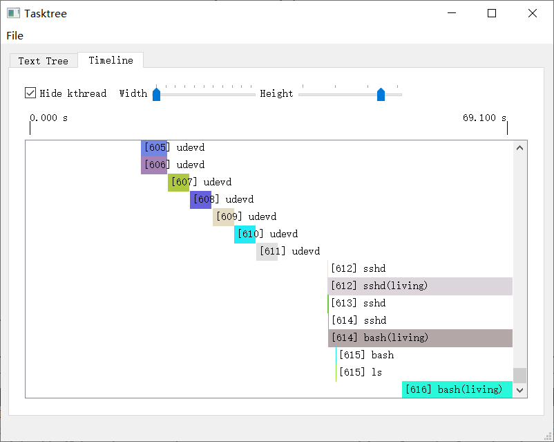

# Tasktree

Visualize the linux LWP tree launched since system booting.

```
[0] idle(living)
 \_ [1] swapper/0 -> [1] init(living)
 |                    \_ [129] init
 |                    |   \_ [130] init -> [130] rc
 |                    |   |                 \_ [133] rc -> [133] stty
 |                    |   |                 \_ [134] rc -> [134] dmesg
 |                    |   |                 \_ [135] rc
 |                    |   |                 |   \_ [136] rc -> [136] ls
 |                    |   |                 \_ [137] rc -> [137] S00mountvirtfs
 |                    |   |                 |               \_ [138] S00mountvirtfs -> [138] stty
 |                    |   |                 |               \_ [139] S00mountvirtfs -> [139] mountpoint
 |                    |   |                 |               \_ [140] S00mountvirtfs -> [140] mount
 |                    |   |                 |               \_ [141] S00mountvirtfs -> [141] mkdir
 |                    |   |                 |               \_ [142] S00mountvirtfs -> [142] chmod
 |                    |   |                 |               \_ [143] S00mountvirtfs -> [143] echo
 |                    |   |                 |               \_ [144] S00mountvirtfs
 |                    |   |                 |               |   \_ [145] S00mountvirtfs
 |                    |   |                 |               |   \_ [146] S00mountvirtfs -> [146] sed
 |                    |   |                 |               \_ [147] S00mountvirtfs
 |                    |   |                 |               |   \_ [148] S00mountvirtfs -> [148] date
 |                    |   |                 |               |   \_ [149] S00mountvirtfs -> [149] hostname
 |                    |   |                 |               \_ [150] S00mountvirtfs -> [150] echo
 |                    |   |                 |               \_ [151] S00mountvirtfs -> [151] mountpoint
 |                    |   |                 |               \_ [152] S00mountvirtfs -> [152] echo
 |                    |   |                 |               \_ [153] S00mountvirtfs
 |                    |   |                 |               |   \_ [154] S00mountvirtfs
 |                    |   |                 |               |   \_ [155] S00mountvirtfs -> [155] sed
 |                    |   |                 |               \_ [156] S00mountvirtfs -> [156] echo
 |                    |   |                 |               \_ [157] S00mountvirtfs -> [157] mount
 |                    |   |                 |               \_ [158] S00mountvirtfs -> [158] mountpoint
 |                    |   |                 |               \_ [159] S00mountvirtfs -> [159] echo
 |                    |   |                 |               \_ [160] S00mountvirtfs
 |                    |   |                 |               |   \_ [161] S00mountvirtfs
...
```

## How to use?

1. Modify the kernel to log all `fork`/`exec`/`exit` calling to /var/log/kern.log. (We don't distinguish between threads and processes. Because there is only LWP in kernel. `_do_fork` is called to copy LWP. So we use `fork` here.)
2. Copy the log recorded since system booting to a separating log file.
3. Use this tool to parse the log.

## How to modify kernel?

For example, in linux-5.2.8, we need to modify 3 files: kernel/fork.c, fs/exec.c, kernel/exit.c

### kernel/fork.c

In function `copy_process`, we need to insert a `printk` line above `return p;`

```c
...
    trace_task_newtask(p, clone_flags);
    uprobe_copy_process(p, clone_flags);
    printk(KERN_ERR "FORK|%d|%s|=>|%d|%u", current->pid, current->comm, p->pid, p->flags & PF_KTHREAD); // Inserted here!
    return p;
...
```

### fs/exec.c

In function `__set_task_comm`, we need to insert a `printk` line in the beginning.

```c
void __set_task_comm(struct task_struct *tsk, const char *buf, bool exec)
{       
    printk(KERN_ERR "EXEC|%d|%s|=|%s", tsk->pid, tsk->comm, buf); // Inserted here!
    task_lock(tsk);
    trace_task_rename(tsk, buf);
    strlcpy(tsk->comm, buf, sizeof(tsk->comm));
    task_unlock(tsk);
    perf_event_comm(tsk, exec);
}
```

### kernel/exit.c

In function `do_exit`, we need to insert a `printk` line in the beginning.

```c
void __noreturn do_exit(long code)
{       
    printk(KERN_ERR "EXIT|%d|%s", current->pid, current->comm); // Inserted here!
    struct task_struct *tsk = current;
    int group_dead;

    profile_task_exit(tsk);
...
```

The modified kernel will produce log like following:

```
[    4.070211] FORK|170|S05modules|=>|172|0
[    4.082378] EXEC|172|S05modules|=|egrep
[    4.092978] EXEC|172|egrep|=|grep
[    4.098429] EXIT|172|grep
[    4.099345] EXIT|170|S05modules
[    4.099777] FORK|130|rc|=>|173|0
[    4.100872] EXEC|173|rc|=|S08localnet
[    4.102791] FORK|173|S08localnet|=>|174|0
[    4.103201] EXEC|174|S08localnet|=|stty
[    4.104313] EXIT|174|stty
[    4.108745] FORK|173|S08localnet|=>|175|0
[    4.123296] EXEC|175|S08localnet|=|cat
[    4.125846] EXIT|175|cat
[    4.126549] FORK|173|S08localnet|=>|176|0
```

## Text tree

The text tree output is like the following:

```
[0] idle(living)
 \_ [1] swapper/0 -> [1] init(living)
 |                    \_ [129] init
 |                    |   \_ [130] init -> [130] rc
 |                    |   |                 \_ [133] rc -> [133] stty
 |                    |   |                 \_ [134] rc -> [134] dmesg
 |                    |   |                 \_ [135] rc
 |                    |   |                 |   \_ [136] rc -> [136] ls
 |                    |   |                 \_ [137] rc -> [137] S00mountvirtfs
 |                    |   |                 |               \_ [138] S00mountvirtfs -> [138] stty
 ```

`" -> "` means an `exec` calling. 

`" \_ "` means a `fork` calling.

The is similar with `ps(1)`/`pstree(1)`. But `ps(1)`/`pstree(1)` can only output the living LWP.

## Timeline

This tool can also generate a timeline view:


